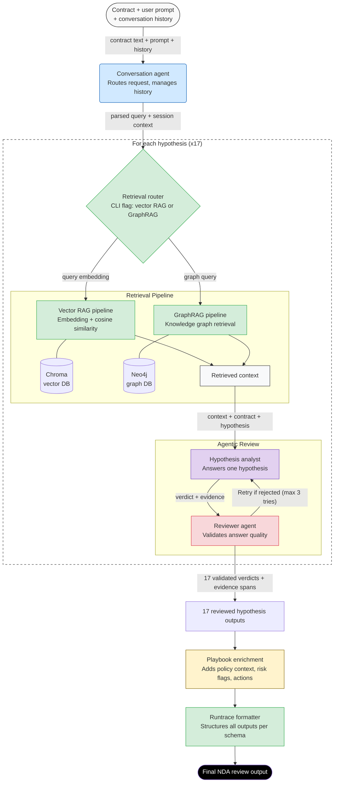

# NDA Review — Multi-Agent Architecture (Updated)

### Key Changes:
- **Scope Expansion**: The "For each hypothesis (x17)" dotted boundary (represented by the `Loop` subgraph) now includes the **Retrieval Router**, **Vector RAG**, and **GraphRAG** pipelines.
- **Granular Retrieval**: This indicates that the system performs a targeted retrieval query for each specific hypothesis rather than a single bulk retrieval for the entire contract.
- **Agent Integration**: The Hypothesis Analyst and Reviewer Agent remain within the loop, receiving context tailored to each specific hypothesis.
